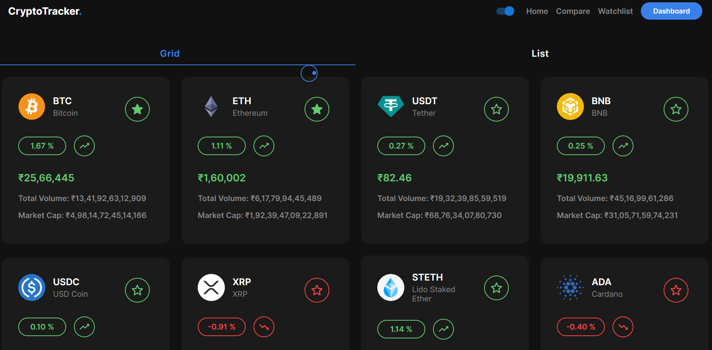
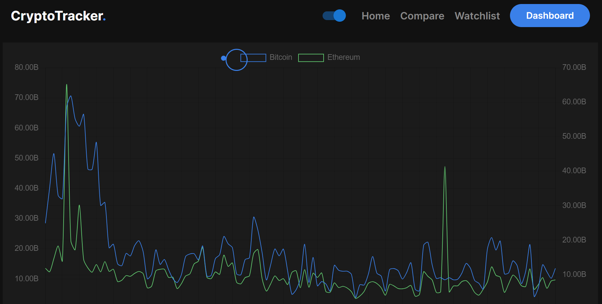

[Link 💻](https://phenomenal-zabaione-193bc7.netlify.app/)
# CryptoTracker
CryptoTracker makes it easy for you to analyze, visualize, monitor and watchlist cryptocurrency coins. You can use this project to track Price, Total Volume and Market Capital. React.js based website made using `CoinGecko API`, `Chart.JS`, `Framer Motion` and `Material UI` to track all the popular 100 Cryptocurrency coin prices.

# Screenshots

# Dependencies
* react
* react-router-dom
* react-chartjs-2
* chat-js
* framer-motion
* mui
* axios
